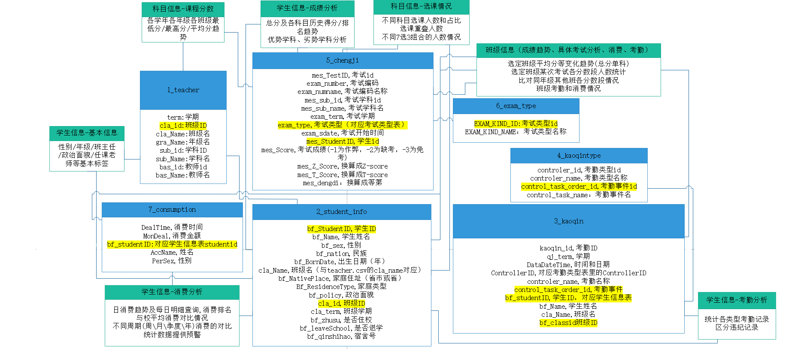

### 比赛攻略

#### 赛题背景

背景介绍：教育数据分析目的包括改善学生成绩，服务教务设计，优化学生服务。而学生成绩中有一系列重要的信息往往被我们常规研究所忽视。通过大数据分析和可视化展示，挖掘重要信息，改善学生服务，对于教学改进意义重大。美国教育部门构建“学习分析系统”，旨在向教育工作者提供了解学生到底是在“怎样”学习的更多、更好、更精确信息。利用大数据的学习分析能够向教育工作者提供有用的信息，从而帮助其回答这些不太好回答的现实问题。未来学生的学习行为画像、考试分数、发展潜力方向等所有重要的信息等数据价值将会持续被显现出来，大数据将掀起新的教育革命，比如革新学生的学习、教师的教学、教育政策制定的方式与方法。为了更好的优化教学大数据应用场景，比赛通过学校教育数据分析和可视化工作，探索面向学生、校园的数据分析体系，募集优秀数据分析及可视化方案，设计并形成数据分析门户，从而更好服务精细化教学管理工作。

通过赛题的背景介绍明确最终要生成的是信息门户，其目的是挖掘信息、改善学生服务。因此我们不能仅查看学校整体的情况，而是要针对每一个学生／班级提供定制化分析，分析的范围越小，代表着分析的数据更具有特殊性，更能帮助教师查看选中学生／班级的各项指标。

#### 赛题理解与数据分析

首先拿到数据后对数据进行分析，结合要求指标将数据分为基本信息、考勤、消费、成绩四个大类。同时试图站在班主任、年级主任、校领导的角度，去设想他们都希望得到哪些信息，并将页面设计为四个部分，全校信息概览、具体学生分析、具体班级分析、课程分析（特别是选课情况）。

> 于班主任而言，每个学生的成绩上——优势劣势学科是哪些、某段时期的成绩变化是呈稳步上升趋势还是不断下降，特别是非平时考试成绩；每个学生消费情况上——平均日消费水平、最爱在哪个时段消费、这个周期和上个周期比有没有较大差异；每个学生的考勤情况上——早退多少次、迟到多少次，其中又特别关注违纪情况；除了了解一个同学的基本信息，更希望能对对比两个学生的情况。
>
> 于年级主任而言，该年级各班的成绩、考勤、消费情况；某次考试某个班的成绩排名、各分数段人数，各班之间的对比情况；某班的违纪情况主要集中在哪几个同学身上；某班低消费同学都有哪些。
>
> 于校领导而言，除了具体班级和具体学生的消费、考勤情况，他们更关心的是整体的分布。学校的人数分布，各年级人数分布、各性别分布、走读生人数、住校生人数等；消费分布，消费的人数、金额都集中在什么时间段、不同年级、性别在哪个时间段集中就餐等；考勤分布，学生的进离校时间，各年级的考勤情况及其变化趋势。

页面信息和原始数据的对应关系如下图，图片中的高亮部分表示两个表之间的引用关系，可在数据库设计时当做外键；蓝色框图表示原始数据表及其属性；绿色框图表示部分页面内容（考虑到上图的复杂度，并没有将首页整体概览部分与原始数据表关联的情况展示在图中）。

确定页面呈现信息及与原始数据之间的关联后，进一步分析原始数据并设计数据库表，便于后续数据值更改的情况下系统呈现相应的变化，提高页面的灵活性。

#### 页面设计详细逻辑

> 数据的呈现分为四个部分。
>
> 第一部分是总体概览，查看概览信息，将数据的呈现进一步分为：总体情况、人员分布、一卡通消费、考勤情况四个小模块；
>
> 第二部分是学生信息呈现，用户可以通过学生姓名或ID查看对应学生的具体情况，包括基本信息、成绩分析、消费分析、考勤分析和学生对比分析；
>
> 第三部分是班级信息呈现，用户可以通过班级ID、年份或班级名称查看对应班级的具体情况，包括班级基本信息、成绩趋势、具体考试分析、消费情况和考勤情况；
>
> 第四部分是科目信息，分为课程分数、选课情况和高考直通车三个部分。通过图表和文字分析的方式呈现数据。

##### 第一部分——总体概览

1. 总体情况，呈现当前在校生的总体样貌；
2. 人员分布，从性别、生源地、民族、政治面貌等方面呈现在校生人员分布情况；
3. 一卡通消费分析，从不同时刻平均消费情况和学校单天消费总额变化趋势两个方面分析；在不同时刻平均消费情况中，将数据展开为性别对比、年级对比、走读／住校生对比三个对比维度，并且提供消费总人数的对比情况（非堆叠柱状图）；
4. 考勤情况，从进离校时间和不同年级不同违纪类型两个方面展开。

##### 第二部分——学生信息

1. 基本信息，利用词云展现该生高中生活的关键词，并呈现个人基本信息(班级信息可跳转)、任课教师情况；
2. 成绩分析子页面，雷达图展示各科目成绩特点，确定优势、劣势和不稳定学科；折线图展示不同考试的成绩变化趋势。可选绝对分、班内排名、离均值、标准分和等第（等第用于体现学生的年级排名概况）作为展示对象，且可选择是否将平时成绩纳入呈现数据；
3. 消费分析子页面，分为总体消费情况概览和某时期消费情况展示。基于该学生历史消费记录构造模型，结合下一天星期数和当天的消费去预测下一天的消费情况（需要两条以上的历史消费数据）；通过选择不同日期和不同周期，对一段时间内的消费情况进行分析（x轴为就选择日期而言的偏移天数），并呈现相应周期内该同学在不同时段与校平均消费水平的对比情况；
4. 考勤分析子页面，呈现不同学期各考勤类型的数据，可筛选其中的违纪数据进行展示；
5. 对比分析子页面，展现与选定对比学生的各科平均成绩、消费情况、考勤情况的对比。

##### 第三部分——班级信息

1. 基本信息，呈现班级学生的分布、授课教师的信息；
2. 成绩趋势子页面，呈现该班在不同考试中成绩的变化趋势，可选择绝对分或排名作为展示指标，且可选择是否将平时成绩纳入呈现数据；
3. 具体考试分析子页面，选定该班参与的某一场考试，页面呈现考试参与人数和成绩的概况，显示本次考试该班学生的成绩和排名（学生信息可点击跳转查看）、与其他班成绩的对比情况，对于具体科目，还会呈现各分数段人数分布，可对比指标有绝对分、标准分、离均值；
4. 消费情况子页面，呈现该班各学生日平均消费情况，并从中筛选出不到校消费水平20%的学生，提供跳转链接（由于精度影响，消费水平百分比与学生信息页面数据可能存在1%左右的误差）；
5. 考勤情况子页面，呈现不同学期该班各违纪类型的数据，包括校服违纪、迟到、早退，并提供数据下钻式详情查看功能。

##### 第四部分——科目信息

1. 课程分数分析，各学年各科目各班级最高分、平均分、最低分统计，直观的对比不同班级成绩变化趋势；
2. 选课情况分析，呈现改革（2017年施行7选3选考方式）后，各学年高三各待选科目选课情况分布和七选三组合分布情况。其中，七选三组合分布情况提供筛选查看人数分布的功能（可选择或输入任意七选三组合）。筛选后若高亮未出现在人数详情方格图中表明当年未出现该组合选课情况；若高亮出现在人数详情方格图，但未出现在占比详情中则该组合包含于"其他"之中；
3. 高考直通车，通过爬取并分析浙江省教育考试网数据，统计2019年高校不同专业招生指定科目情况，呈现选课与填报志愿专业的双向关系，便于深入理解选课情况的变化趋势，为日后选课提供辅助材料。

#### 数据处理过程

##### 数据库表设计

1. 班级
   - Class
     - id: integer # 班级序号
     - class_name: string # 班级名称
     - grade_name: integer (constant) # 年级序号
     - campus_name: integer (constant) # 校区名称编号
     - start_year:  integer (constant) # 班级所属年份
2. 课程
   - Course # 科目
     - id: integer # 课程编号
     - name: string # 课程名称
   - CourseRecord # 选课记录
     - student: ref # 学生外键
     - course: ref # 科目外键
     - year: ref # 毕业年份
3. 学期
   - Term
     - id: integer # 学期序号
     - start_year: integer # 学期起始年份
     - end_year: integer # 学期终止年份
     - order: integer (constant) # 所处学期数（上/下学期）
4. 教师
   - Teacher # 教师信息
     - id: integer # 教师工号
     - name: string # 教师名称
   - TeachRecord # 教学记录
     (由于同一个老师每个学期会教不同班级，因此每个学期会产生一条教学记录)
     - teacher: ref # 教师外键
     - term: ref # 学期外键
     - teach_class: ref # 班级外键
     - course: ref # 科目外键
5. 学生
   - Student # 学生信息
     - id: string # 学号	
     - name: string # 姓名
     - sex: integer (constant) # 性别
     - nation: string # 民族
     - born_year: integer # 出生年份
     - native_place:  string # 户籍所在地
     - residence_type: integer (constant) # 家庭类型
     - policy: integer (constant) # 政治面貌
     - is_stay_school: boolean # 住校 / 走读
     - is_left: boolean # 是否离校（这里将退学和已毕业学生均标记为已离校）
     - room_num: string # 宿舍号
   - StudentRecord # 学习记录
     (每个学生每学年的班级序号会发生变化，因此每个学期产生一次学生信息记录)
     - id: integer # 记录编号
     - student: ref # 学生外键
     - stu_class: ref # 班级外键
     - term: ref # 学期外键
6. 考勤
   - KaoqinType # 考勤类型
     - id: string # 编号
     - name: string # 考勤类型名称
   - KaoqinEvent # 考勤类型事件
     (event 可以理解为 type 下的细则)
     - id: string
     - name: string # 名称
     - type: ref # 类型外键
   - KaoqinRecord # 考勤记录
     - id: integer # 编号
     - created_at: dateTime # 生成时间
     - event: ref # 事件外键
     - student: ref # 学生外键
     - term: ref # 学期外键
7. 考试
   - ExamType # 考试类型
     - id: integer # 编号
     - name: string # 名称
   - Exam # 考试
     (一场考试，如：全市联考为一个exam)
     - id: integer # 编号
     - type: ref # 类型外键
     - term: ref # 学期外键
     - name: string # 名称
   - SubExam # 含科目考试
     (一场考试中的一个科目是一个 subexam)
     - exam: ref # 考试外键
     - course: ref # 科目外键
     - started_at: date # 考试时间
     - total_score: float # 总分
     - attend_num: integer # 参考人数
     - standard: float # 本场考试标准差
   - StudentExamRecord # 学生考试记录
     (学生每参加一场考试生成一条record)
     - student: ref # 学生外键
     - sub_exam: ref # 科目考试外键
     - score: float # 原始分
     - z_score: float # 离均值
     - t_score: float # 标准分
     - dengdi: float # 等第
     - class_rank: integer # 班级排名
   - ClassExamRecord # 班级考试记录
     (班级某次考试某个科目的数据条目）
     - stu_class: ref # 班级外键
     - sub_exam: ref # 科目考试外键
     - total_score: float # 班级总分
     - attend_count: integer # 参考人数
     - highest_score: float # 最高分
     - lowest_score: float # 最低分
     - order: integer # 班级排名
     - z_score: float # 平均得分离均值
     - t_score: float # 平均得分标准差
8. 消费
   - Consumption # 消费记录
     - id: integer # 编号 
     - created_at: dateTime # 消费时间
     - cost: float # 消费金额
     - student: ref # 学生外键
   - DailyConsumption # 日消费总额
     - date: date # 日期
     - total_cost: float # 消费总额
     - student: ref # 学生外键
   - HourlyConsumption # 每日每小时消费总额
     - date: date # 日期
     - hour: integer # 小时数
     - total_cost: float # 总消费
     - student: ref # 学生外键
9. 词云
   - WordCloudTag # 词云标签
     - title: string # 名称
     - type: integer(constant) #	类别（学生标签 / 选课标签）
     - description: string # 备注信息
   - TagRecord # 学生词云记录
     - tag: ref # 词云标签外键
     - student: ref # 学生外键
     - value: integer # 权重
   - CourseTag # 选课影响报考标签
     - tag: ref # 标签外键
     - course: fef # 课程外键
     - value: integer # 权重

##### 数据处理过程

1. 处理 4_kaoqintype.csv，存储考勤类型及考勤事件的对应关系

2. 处理 6_exam_type.csv，存储考试类型数据

3. 处理 1_teacher.csv，获取教师信息、学期数据、班级数据、课程名称数据，从而生成教学记录数据

4. 处理 2_student_info.csv，获取学生信息、学期数据、班级数据，从而生成学习记录数据。其中，学生籍贯使用 [cpca](https://github.com/DQinYuan/chinese_province_city_area_mapper) 第三方库处理，将学生籍贯处理后，浙江地区学生（若有提供市级信息）细分到市级信息，其他地区分到省级信息；未提供籍贯标记为"未登记"；

5. 处理 3_kaoqin.csv，获取学生信息（若不在2_student_info.csv内则标记为已离校）、班级数据、学期数据，可生成部分已离校学生的学习记录和所有学生的考勤记录，其中，考勤类型代号以100、200、300开头的数据并没有使用。因为这些数据，一方面时间范围在2013年-2016年较为久远；另一方面，与考勤类型代号9900开头的考勤数据时间上有重叠部分。

6. 处理 7_consumption.csv，通过 PerSex 字段校准学生性别，生成学生消费记录

7. 处理 5_chengji.csv，获取学期数据、课程数据、考试类型、学生数据（对至此未出现过的学生保存学号，姓名未知，标记离校），生成考试信息、科目考试信息、学生考试记录、班级考试记录，并计算班级总分及参考人数情况。其中，2_student_info.csv中，存在班级为"高 x 未分班"学生五位：14564/14577/14716/13967/15559，通过5_chengji.csv发现他们考试固定与某些班级关联，因此将其班级数据呈现到所关联班级中。

8. 其中以“宁波‘十校’2017届高三5月适应性考试”为例，存在原始分数高但等第计算更接近1（排名靠后）的问题

   > 例如：5_chengji.csv中，275号考试（宁波“十校”2017届高三5月适应性考试）英语成绩中 ，学号12466和12749，成绩分别为137.5和135.5，但是等第分别为0.037…和0.018…，存在谬误

   因此我们对Z分、T分和等第依据相关计算方式进行了重新计算。

   - Z分的计算方法：计算每一场考试所有学生成绩的平均分、标准差，将当前学生分数与平均分的差值除以标准差的值计作该生这场考试的Z分(z_score)。
   - T分的计算方法：T分=z_score*8 + 80，（80为基础分，分段差8分）。
   - 等第的计算方法：采用五等第法，将学生排名分为ABCDE五个等级。

9. 对于已存入数据库的考试记录数据，仅考虑2017年后（17 年开始施行7选3）学生在参与模拟考/五校联考/十校联考的考试记录，生成每位学生的选课情况

10. 利用 步骤7 生成的班级考试记录/学生考试记录，计算某场考试中，某年级的标准差，进而计算出各个考生考试记录的离均值/标准分/等第/班级排名

11. 根据 步骤4、步骤5 生成的考生学习记录，将学期数据补全，例如，生成的记录中仅有17年上半学期就读于912班，那么应该补全17年下半学期也就读于912班。

12. 根据 步骤5、步骤6、步骤7 生成的数据，使用一些规则（见下方 **学生词云规则 **模块），生成词云数据

13. 由于 步骤4 中学生户籍所在地存在仅有市/县/区等情况，因此，对户籍所在地字段进行处理，将学生户籍所在地使用第三方库处理为 "xxx省xxx市"的格式

14. 对所生成的班级数据进行处理，将未标记 "白" 的班级划分为东部校区，否则为 "白杨校区"

15. 对 [浙江省教育考试网2019年拟在浙招生高校专业（类）选考科目要求范围的说明](http://zt.zjzs.net/xk2019/allcollege.html) 信息进行爬虫抓取汇总，记录考生选课与高校报考专业的关联关系，生成subject.csv后，生成高校专业与选课关系的词云数据

#### 比赛总结

这是第一次参加天池的比赛，开始拿到数据的时候有些丈二和尚摸不着头脑，和算法比赛的具体化要求不一样，可视化的比赛除了考验一定的编程能力外还考察了产品设计能力。前一个月主要精力放在赛题理解、数据整理、页面设计、技术选型，后面近两个月才将重心放在系统实现上。这段时间的比赛，丰富了我们的研究生生活，提高的系统开发能力，改变了我们看问题的方式，更全面更多样化。总之，受益匪浅。同时，也希望我们的作品真的能给效实中学带来实质性的帮助。

> 系统代码及更多详细文档，参见[Github](https://github.com/Thomstrong/Arsenal-DataAnalysis) （2019.06.16后开源）
>

